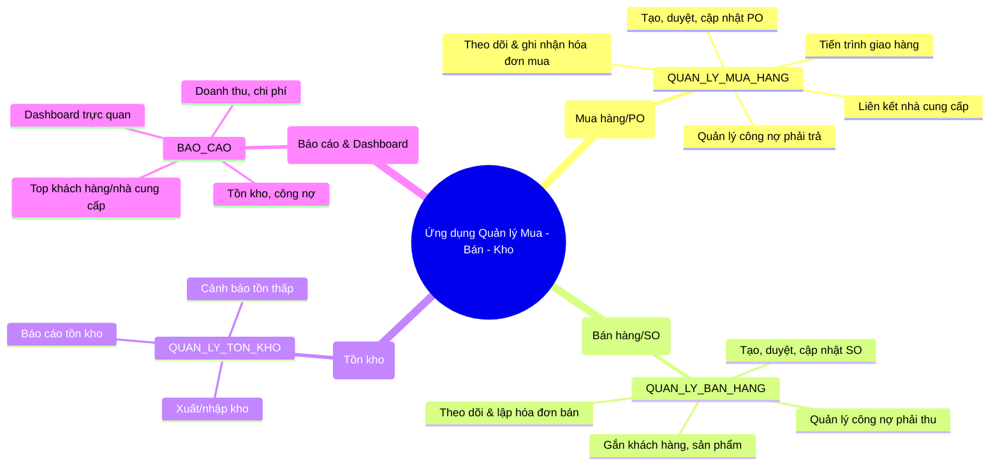
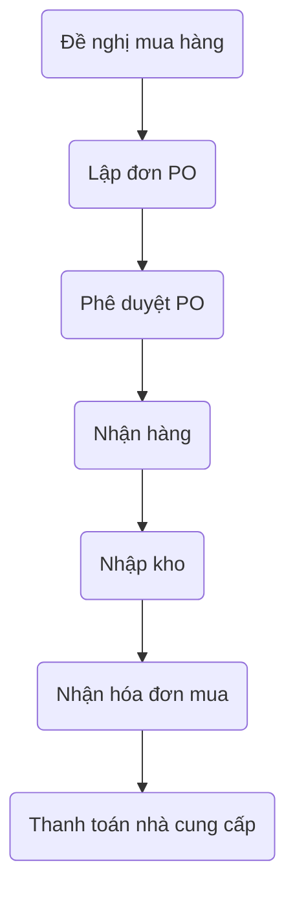
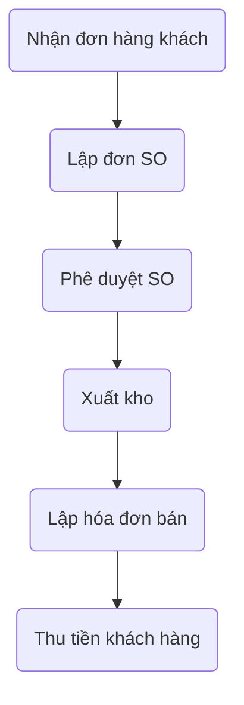

## Bối Cảnh Cụ Thể

Công ty hiện đang vận hành các quy trình mua hàng (nhập nguyên liệu, vật tư), bán hàng (phân phối, kinh doanh sản phẩm), quản lý xuất/nhập tồn kho chủ yếu trên Excel, thủ công hoặc các nền tảng nhỏ lẻ không liên kết. Điều này dẫn tới các vấn đề như:
- Dữ liệu rời rạc, thiếu sự kiểm soát tập trung.
- Dễ phát sinh sai sót do nhập liệu thủ công.
- Khó theo dõi tiến độ thực hiện đơn hàng, công nợ, tài sản kho thực tế.
- Rủi ro chậm trễ trong quản trị dòng tiền và đặt hàng.

Để giải quyết vấn đề đó, ban lãnh đạo quyết định **phát triển hệ thống quản lý mua, bán, tồn kho trên nền tảng Oracle APEX**, đáp ứng các chuẩn kiểm soát nội bộ, cho phép tích hợp dữ liệu và tự động hóa quy trình.

---

## Yêu Cầu Công Việc Cụ Thể

### **Yêu Cầu Chính**

> **Phát triển một hệ thống phần mềm quản lý toàn bộ quy trình mua hàng, bán hàng, tồn kho, hóa đơn và công nợ trên nền tảng Oracle APEX. Ứng dụng cần đáp ứng các yêu cầu nghiệp vụ chuẩn hóa, cho phép các bộ phận mua hàng, bán hàng, kế toán và kho tương tác trực tuyến, kiểm soát tức thời tiến trình đơn hàng, xuất/nhập kho, hóa đơn và dòng tiền. Toàn bộ dữ liệu, xử lý nghiệp vụ, phân quyền người dùng và các hoạt động báo cáo phải được tích hợp và đồng bộ hóa trong cùng một hệ thống, đảm bảo an toàn, bảo mật và có khả năng mở rộng.**

#### **Các chức năng cụ thể cần triển khai giai đoạn đầu bao gồm:**

1. **Quản lý mua hàng (Purchasing):**
   - Tạo, duyệt, theo dõi đơn đặt hàng mua (PO), liên kết nhà cung cấp, ghi nhận hóa đơn và công nợ phải trả.

2. **Quản lý bán hàng (Sales):**
   - Tạo, duyệt, theo dõi đơn bán hàng (SO), quản lý thông tin khách hàng, lập hóa đơn và công nợ phải thu.

3. **Quản lý tồn kho:** *(Có thể giai đoạn 2)*
   - Theo dõi xuất nhập tồn kho, cảnh báo tồn kho thấp.

4. **Báo cáo & phân tích:**
   - Cung cấp các báo cáo động về doanh thu, chi phí, công nợ, tồn kho, top khách hàng/nhà cung cấp và dashboard cho quản trị.

5. **Hệ thống phân quyền:**
   - Đảm bảo bảo mật từng vai trò/phòng ban (Purchasing/Sales/Kho/Kế toán).
6. **Hỗ trợ đa ngôn ngữ:**
   - Ứng dụng cần cung cấp giao diện tiếng Anh, tiếng Việt và tiếng Nhật.

--- 

# Basic Design Chi Tiết Ứng Dụng Quản Lý Mua Bán & Kho

## 1. Tổng Quan Hệ Thống

Ứng dụng bao gồm 4 phân hệ chính:

- **Quản lý mua hàng (Purchasing)**
- **Quản lý bán hàng (Sales/Order Management)**
- **Quản lý tồn kho (Inventory)**
- **Báo cáo & phân tích (Reporting & Analytics)**

---

## 2. Sơ Đồ Kiến Trúc Chức Năng

---

## 3. Phân Rã Chức Năng Chi Tiết

### A. Quản Lý Mua Hàng (Purchasing)

- **Quản lý Đơn đặt hàng (PO)**
  - Tạo mới, chỉnh sửa, xóa PO
  - Quy trình phê duyệt PO
  - Theo dõi trạng thái (mới, chờ duyệt, đã duyệt, đã giao…)
  - Đính kèm vendor, sản phẩm
  - Ghi nhận lịch sử xử lý đơn

- **Quản lý Nhà cung cấp**
  - Đăng ký, cập nhật thông tin vendor
  - Xem lịch sử giao dịch theo vendor
  - Đánh giá, phân loại nhà cung cấp

- **Theo dõi hóa đơn & thanh toán**
  - Ghi nhận hóa đơn mua từ vendor
  - Quản lý công nợ phải trả
  - Theo dõi tiến độ thanh toán theo hóa đơn, PO

---

### B. Quản Lý Bán Hàng (Order Management)

- **Quản lý Đơn bán hàng (SO)**
  - Tạo mới, chỉnh sửa, xóa SO
  - Quy trình phê duyệt SO
  - Đính kèm khách hàng, sản phẩm/dịch vụ
  - Theo dõi trạng thái (mới, chờ duyệt, đã duyệt, đã giao…)

- **Quản lý Khách hàng**
  - Quản lý thông tin, lịch sử đơn hàng
  - Thống kê giao dịch

- **Theo dõi hóa đơn & thu tiền**
  - Lập hóa đơn bán, ghi nhận thanh toán
  - Quản lý công nợ phải thu
  - Theo dõi tiến độ thu tiền

---

### C. Quản Lý Tồn Kho (Inventory) – **Tích hợp sau**

- Theo dõi xuất/nhập kho
- Tính toán lượng tồn thực tế
- Báo cáo tồn kho
- Cảnh báo hàng dưới mức tối thiểu

---

### D. Báo Cáo & Phân Tích

- Báo cáo doanh thu, chi phí, công nợ
- Báo cáo tồn kho, biến động tồn kho
- Thống kê top khách hàng, nhà cung cấp
- Dashboard trực quan theo thời gian thực

---

## 4. Mô Tả Quy Trình Nghiệp Vụ

### a. Quy Trình Mua Hàng

---

### b. Quy Trình Bán Hàng

## Quy tắc lập trình giao diện

Dự án này sử dụng **Tailwind CSS** kết hợp **Flowbite** để xây dựng giao diện.

### Hướng dẫn sử dụng nhanh
- Thêm Tailwind bằng phương thức Play CDN: <https://tailwindcss.com/docs/installation/play-cdn>
- Cài đặt Flowbite thông qua CDN: <https://flowbite.com/docs/getting-started/introduction/>
- Tận dụng các lớp tiện ích của Tailwind cho bố cục và kiểu dáng cơ bản.
- Sử dụng các thành phần Flowbite cho các yếu tố tương tác như thanh điều hướng, modal, nút bấm.
- Hạn chế viết CSS tuỳ chỉnh trừ khi thật cần thiết.

### Quy trình trang tạo/cập nhật thanh toán
1. **Nhập form** – người dùng điền dữ liệu.
2. **Xác nhận** – hiển thị màn hình xác nhận nội dung đã nhập.
3. **Lưu** – sau khi xác nhận, lưu dữ liệu vào cơ sở dữ liệu.
