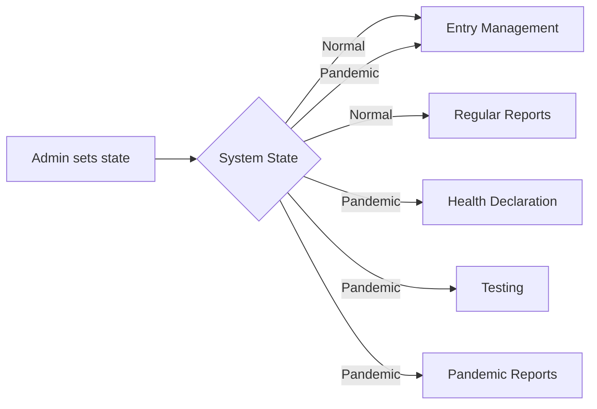

# Thiết Kế Cơ Bản – Demo Quản Lý Kiểm Dịch

Tài liệu này mô tả tổng quan thiết kế của ứng dụng Oracle APEX quản lý kiểm dịch.

## 1. Tổng quan hệ thống
Ứng dụng mô phỏng quy trình kiểm dịch tại sân bay/cửa khẩu và hỗ trợ hai trạng thái:

- **Normal**: chỉ có form và thống kê đơn giản.
- **Pandemic**: bổ sung khai báo y tế, xét nghiệm và cảnh báo.

Cờ trạng thái được lưu tại bảng hoặc application item để điều khiển điều kiện hiển thị UI trên toàn bộ trang.

## 2. Cấu trúc module
Mỗi module tương ứng một thành viên. Trang và logic sẽ ẩn hoặc hiện tùy theo trạng thái hệ thống.

| Module | Nhiệm vụ |
|-------|----------|
| **State Management** | Trang admin chuyển trạng thái hệ thống, ghi log mọi thay đổi. |
| **Entry Management** | CRUD thông tin người nhập cảnh (name, passport, nationality, entry date, ...). |
| **Health Declaration** | Form động; các trường bổ sung (contact history, exposure regions, test file upload) chỉ hiện khi trạng thái `Pandemic`. |
| **Testing Management** | Đăng ký xét nghiệm, lưu kết quả, cảnh báo ca dương tính. Chỉ hiển thị khi trạng thái `Pandemic`. |
| **Pandemic Reporting** | Thống kê ca nghi nhiễm hàng ngày, tổng số xét nghiệm, xuất Excel/PDF. Chỉ hiển thị khi `Pandemic`. |
| **Regular Reporting** | Thống kê nhập cảnh theo ngày/tuần, chỉ trong trạng thái `Normal`. |
| **Dynamic Navigation** | Menu/sidebar hiển thị tùy trạng thái và vai trò người dùng. |

## 3. Phác thảo CSDL
Dưới đây là danh sách bảng đơn giản cho demo, các cột có thể điều chỉnh khi triển khai.

- **SYSTEM_STATUS** `(ID, STATUS, UPDATED_AT, UPDATED_BY)` – lưu trạng thái hệ thống hiện tại.
- **STATUS_HISTORY** `(ID, STATUS, CHANGED_AT, CHANGED_BY)` – bảng log chuyển trạng thái.
- **TRAVELERS** `(ID, FULL_NAME, PASSPORT_NO, NATIONALITY, ENTRY_DATE, NOTE)` – dữ liệu nhập cảnh.
- **HEALTH_DECLARATIONS** `(ID, TRAVELER_ID, SYMPTOMS, CONTACT_HISTORY, RISK_ZONES, TEST_FILE, DECLARED_AT)` – các trường bổ sung khi dịch.
- **TEST_ORDERS** `(ID, TRAVELER_ID, TEST_DATE, RESULT, ALERT_FLAG)` – chỉ tạo khi dịch.

## 4. Tổng quan trang & logic
- **Dashboard** – hiển thị trạng thái hiện tại và liên kết nhanh tới các module. Quản trị viên có thể chuyển trạng thái tại đây.
- **Entry CRUD Pages** – có ở mọi trạng thái; các trường bắt buộc thay đổi theo trạng thái thông qua Dynamic Actions.
- **Health Declaration Form** – hiển thị thêm phần khi trạng thái `Pandemic`.
- **Testing Module Pages** – điều kiện hiển thị sử dụng `Server Side Condition` kiểm tra trạng thái.
- **Reports** – trang báo cáo riêng cho thời dịch và bình thường; dùng APEX interactive reports.
- **Menu** – danh sách động liên kết tới module; quyền xem phụ thuộc trạng thái và vai trò.

## 5. Luồng đơn giản (Mermaid)

