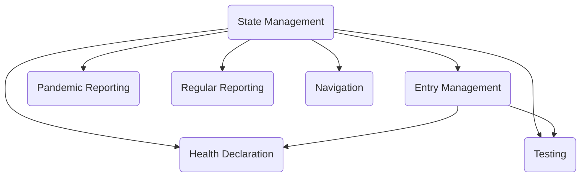

# Thiết Kế Chi Tiết Các Màn Hình

Thư mục này mô tả chi tiết từng màn hình của ứng dụng quản lý kiểm dịch. Các tệp được tách riêng để thuận tiện theo dõi.

## Mối quan hệ tổng thể

Màn hình **State Management** là trung tâm, quyết định việc kích hoạt/ẩn các module khác. Module **Navigation** điều chỉnh menu theo trạng thái hệ thống.

## Tóm tắt chức năng chính của từng màn hình

| Màn hình | Vai trò | Quan hệ |
|----------|---------|---------|
| **State Management** | Chuyển trạng thái hệ thống, ghi log. | Kích hoạt hoặc vô hiệu hóa các module khác; gọi refresh menu. |
| **Entry Management** | Quản lý danh sách người nhập cảnh. | Sau khi thêm mới có thể mở **Health Declaration**. |
| **Health Declaration** | Thu thập thông tin sức khỏe chi tiết. | Liên kết 1-1 với `TRAVELERS`, có thể tạo **Testing** khi cần. |
| **Testing Management** | Đăng ký xét nghiệm và lưu kết quả. | Tạo dữ liệu cho **Pandemic Reporting**. |
| **Pandemic Reporting** | Báo cáo tình hình dịch, chỉ khi trạng thái `PANDEMIC`. | Đọc dữ liệu từ `TEST_ORDERS`. |
| **Regular Reporting** | Báo cáo thống kê nhập cảnh trong trạng thái `NORMAL`. | Dùng bảng `TRAVELERS`. |
| **Dynamic Navigation** | Ẩn/hiện menu tùy trạng thái và vai trò. | Tất cả module truy cập thông qua menu này. |

Tài liệu chi tiết hơn được trình bày trong các tệp tương ứng trong thư mục này.

## Bảng ánh xạ Page ID

| Màn hình | Page ID |
|----------|---------|
| Dynamic Navigation | 1 |
| System State Management | 10 |
| Entry List | 20 |
| Entry Form | 21 |
| Entry Detail | 22 |
| Health Declaration Form | 30 |
| Test List | 40 |
| Test Form | 41 |
| Pandemic Report | 50 |
| Regular Report | 60 |
