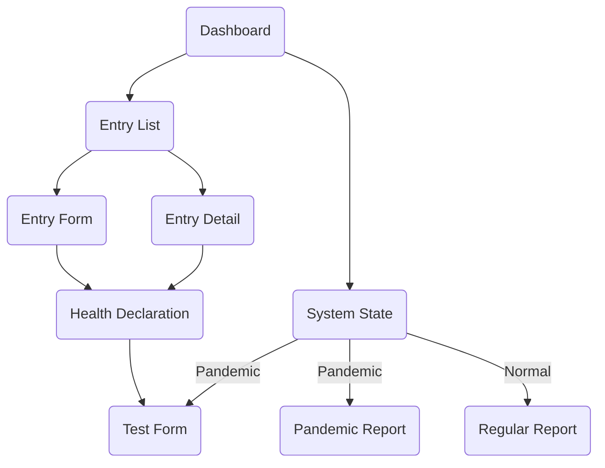
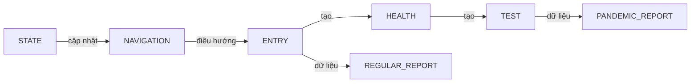
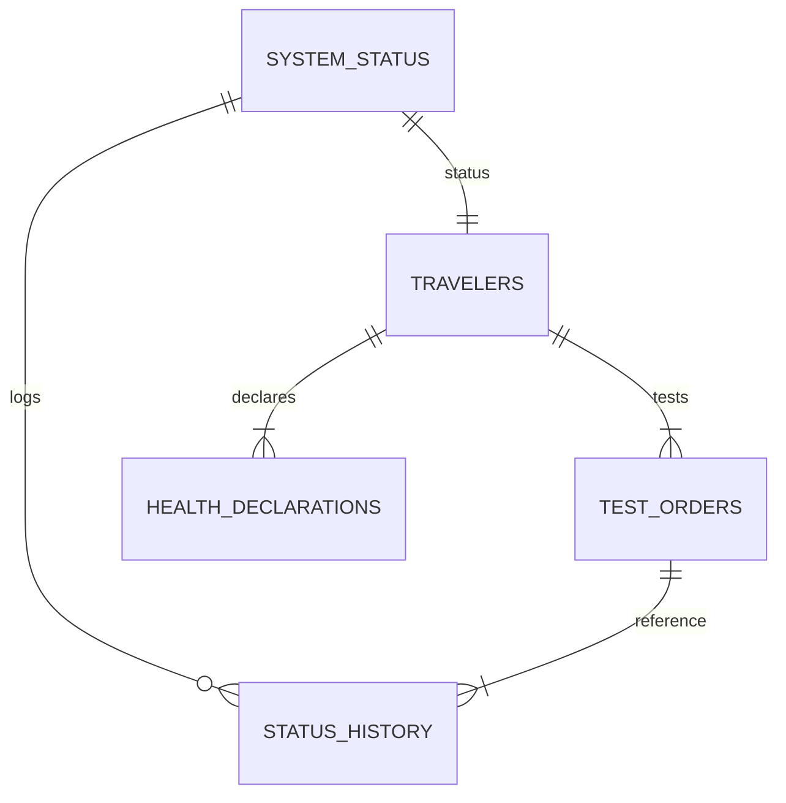

# Sơ Đồ Hệ Thống Quản Lý Kiểm Dịch

Tài liệu này tổng hợp các sơ đồ chính của dự án, bao gồm luồng di chuyển giữa các màn hình, mối liên hệ giữa các chức năng và quan hệ giữa các bảng dữ liệu.

## 1. Sơ Đồ Di Chuyển Màn Hình

Các màn hình chính được kết nối theo thứ tự sử dụng phổ biến. Khi trạng thái hệ thống là `Pandemic`, các trang Xét Nghiệm và Báo Cáo Dịch được kích hoạt.

## 2. Sơ Đồ Liên Hệ Chức Năng

Sơ đồ trên thể hiện sự phụ thuộc giữa các module. `STATE` ảnh hưởng đến `NAVIGATION` và quyết định việc hiển thị các tính năng còn lại.

## 3. Sơ Đồ Quan Hệ Các Bảng (ERD)

Quan hệ bảng ở mức tối giản phục vụ demo: bảng `TRAVELERS` liên kết đến `HEALTH_DECLARATIONS` và `TEST_ORDERS`; `STATUS_HISTORY` ghi nhận lịch sử trạng thái.

