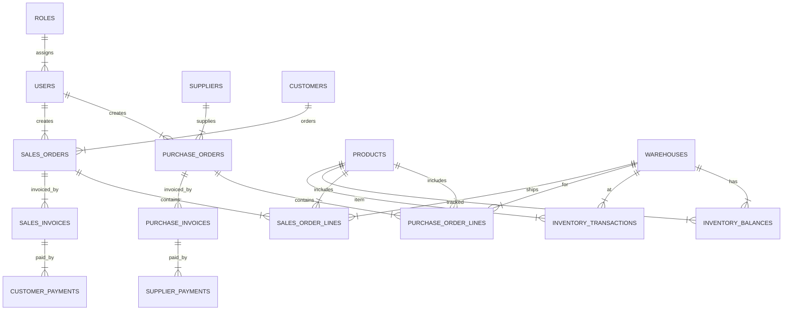

## 1. **Danh Sách Các Table Chủ Đạo**

### **A. Master Data**

- **USERS** – Tài khoản người dùng (nhân viên, quyền, vai trò)
- **ROLES** – Vai trò/nhóm quyền sử dụng ứng dụng
- **CUSTOMERS** – Khách hàng
- **SUPPLIERS** – Nhà cung cấp
- **PRODUCTS** – Sản phẩm/vật tư
- **WAREHOUSES** – Danh mục kho hàng

### **B. Quản Lý Mua Hàng**

- **PURCHASE_ORDERS** – Đơn đặt hàng mua (PO)
- **PURCHASE_ORDER_LINES** – Chi tiết sản phẩm trong PO
- **PURCHASE_INVOICES** – Hóa đơn mua từ nhà cung cấp
- **SUPPLIER_PAYMENTS** – Thanh toán cho nhà cung cấp

### **C. Quản Lý Bán Hàng**

- **SALES_ORDERS** – Đơn bán hàng (SO)
- **SALES_ORDER_LINES** – Chi tiết sản phẩm trong SO
- **SALES_INVOICES** – Hóa đơn bán hàng
- **CUSTOMER_PAYMENTS** – Thu tiền khách hàng

### **D. Quản Lý Kho**

- **INVENTORY_TRANSACTIONS** – Phiếu xuất/nhập kho
- **INVENTORY_BALANCES** – Số tồn kho thực tế từng sản phẩm, từng kho

### **E. Phân Quyền & Nhật Ký**

- **ROLE_PERMISSIONS** – Phân quyền theo vai trò
- **AUDIT_LOGS** – Nhật ký thao tác nghiệp vụ

## 2. **Mối Quan Hệ Bảng (ERD – Dạng Text)**

- **USERS** liên kết nhiều **ROLES**
- **PURCHASE_ORDERS** liên kết **SUPPLIERS**, **USERS** (người tạo, người duyệt)
- **PURCHASE_ORDER_LINES** liên kết **PURCHASE_ORDERS**, **PRODUCTS**, **WAREHOUSES**
- **PURCHASE_INVOICES** liên kết **PURCHASE_ORDERS**
- **SUPPLIER_PAYMENTS** liên kết **PURCHASE_INVOICES**, **SUPPLIERS**
- **SALES_ORDERS** liên kết **CUSTOMERS**, **USERS**
- **SALES_ORDER_LINES** liên kết **SALES_ORDERS**, **PRODUCTS**, **WAREHOUSES**
- **SALES_INVOICES** liên kết **SALES_ORDERS**
- **CUSTOMER_PAYMENTS** liên kết **SALES_INVOICES**, **CUSTOMERS**
- **INVENTORY_TRANSACTIONS** liên kết **PRODUCTS**, **WAREHOUSES**, tham chiếu PO/SO
- **INVENTORY_BALANCES** chứa số dư từng **PRODUCTS** ở từng **WAREHOUSES**

---

## 3. **Minh Họa Sơ Đồ ERD Quan Hệ (Mermaid)**

