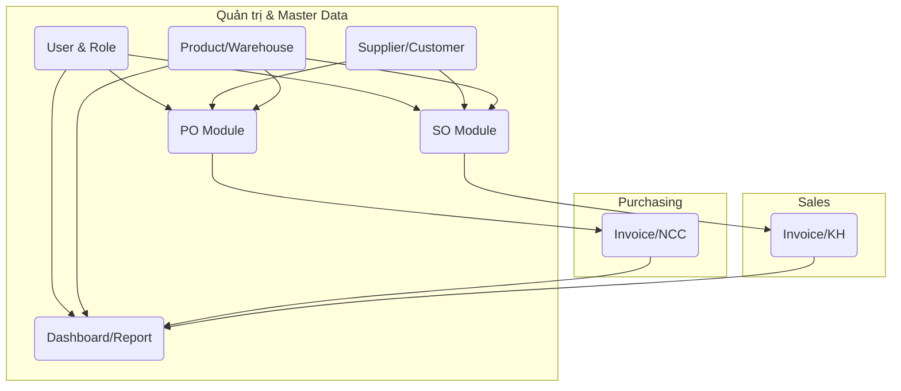

# Phân Chia Công Việc 8 Dev: Ứng Dụng Oracle APEX Quản Lý Mua Bán – Kho  
**Thời gian hoàn thành:** 1 tuần (5 ngày làm việc)  
**Lưu ý:** Đã xác định rõ thiết kế, các dev chỉ tập trung thi công chức năng/module.

---

## 1. **Nguyên Tắc Chia Việc**
- Phân chia theo **phân hệ chính** & **module logic** (tối ưu cho phát triển song song, giảm xung đột).
- Ưu tiên nhóm các chức năng có liên quan để 1 dev phụ trách, tránh phân mảnh nhỏ lẻ.
- Các bảng master (master tables), phân quyền, dashboard thực hiện sớm để phục vụ các module khác.
- Chia rõ đầu việc từng người, định hướng phối hợp kiểm thử lẫn nhau.

---

## 2. **Gán Việc Theo Module & Dev**

| STT | Dev           | Module/Chức năng chính              | Phụ trách chi tiết                                                                                            |
|-----|---------------|-------------------------------------|----------------------------------------------------------------------------------------------------------------|
| 1   | Dev1          | **User & Role Management**          | - CRUD USERS/ROLES, phân quyền ROLE_PERMISSIONS - Đăng nhập, phân quyền từng chức năng - Giao diện quản trị người dùng & nhật ký AUDIT_LOGS - Kiểm tra phân quyền cho menu, trang               |
| 2   | Dev2          | **Supplier & Customer Master**      | - CRUD SUPPLIERS (nhà cung cấp) - CRUD CUSTOMERS (khách hàng) - Giao diện tìm kiếm, lịch sử giao dịch, thống kê cơ bản                                          |
| 3   | Dev3          | **Product & Warehouse Master**      | - CRUD PRODUCTS, WAREHOUSES - Xem tồn kho từng sản phẩm (INVENTORY_BALANCES) - Danh mục hàng hóa, kho hàng - Import dữ liệu mẫu sản phẩm/kho                 |
| 4   | Dev4          | **Quản lý PO & Nhà cung cấp**       | - CRUD PURCHASE_ORDERS, PURCHASE_ORDER_LINES - Liên kết SUPPLIERS, trạng thái PO - Quy trình phê duyệt, theo dõi, track lịch sử, tạo/đính kèm file             |
| 5   | Dev5          | **Hóa đơn & Thanh toán Nhà cung cấp** | - PURCHASE_INVOICES - SUPPLIER_PAYMENTS - Kết nối tiến trình PO → hóa đơn → thanh toán - Quản lý công nợ phải trả, ghi nhận thanh toán từng hóa đơn      |
| 6   | Dev6          | **Sales Order & Khách hàng**        | - CRUD SALES_ORDERS, SALES_ORDER_LINES - Liên kết CUSTOMER, track trạng thái đơn - Theo dõi tiến độ, phê duyệt, xuất đơn hàng                                    |
| 7   | Dev7          | **Hóa đơn bán & Thanh toán Khách hàng** | - SALES_INVOICES - CUSTOMER_PAYMENTS - Kết nối quy trình SO → hóa đơn → thu tiền - Quản lý công nợ phải thu, báo cáo thanh toán                                |
| 8   | Dev8          | **Báo Cáo & Dashboard**             | - Dashboard tổng quan - Báo cáo động (doanh thu, tồn kho, công nợ, top KH/NCC) - Stat/Analytics cơ bản - Giao diện bảng, biểu đồ, filter nâng cao             |

---

### **Chi tiết Giao Việc & Gợi Ý Phối Hợp**

#### **Ngày 1 (Khởi động & Setup data mẫu)**
- Dev1, Dev2, Dev3: Setup toàn bộ các bảng Master (USERS, ROLES, SUPPLIERS, CUSTOMERS, PRODUCTS, WAREHOUSES), import data mẫu → các dev khác dùng chung.
- Dev8: Chuẩn bị Dashboard mẫu, nạp sẵn view/report tĩnh.
- Các dev còn lại chuẩn bị layout các page chính, phân chia task phụ module.

#### **Ngày 2-4 (Phát triển chức năng chính)**
- Dev1 hoàn thành toàn bộ phân quyền, user, kiểm tra security cho các pages con của những dev khác.
- Dev4, Dev5, Dev6, Dev7 đồng thời build PO/SO và các quy trình hóa đơn – thanh toán (theo hướng Module độc lập, gọi API/lưu dữ liệu đúng ERD).
- Dev8 bắt đầu kết nối báo cáo động (từ dữ liệu phát sinh thực tế).

#### **Ngày 5 (Hoàn thiện, kiểm thử chéo & fix bug)**
- Dev1 kiểm tra kiểm soát phân quyền toàn bộ page/module.
- Dev2, Dev3, Dev4, Dev5, Dev6, Dev7 test chéo các luồng nghiệp vụ (ví dụ: Khi tạo một PO/SO, kiểm tra liên kết vendor/customer, xuất/nhập kho, công nợ).
- Dev8 check cross-report, tổng hợp, hoàn tất dashboard.

---

## 3. **Sơ Đồ Giao Việc Tương Tác (Mermaid)**

---

## 4. **Ghi chú & Kiến nghị kiểm soát**
- Yêu cầu các dev sử dụng cùng chuẩn code, naming convention, Oracle APEX template layout, tiêu chuẩn bảo mật và kiểm thử đơn vị (unit test).
- Thường xuyên cập nhật tiến độ toàn team mỗi ngày (stand-up daily).
- Cuối tuần: Tổng hợp, kiểm thử chéo toàn bộ các workflow, bàn giao staging/demo cho PL kiểm tra.

---

## 5. **Tóm tắt phân chia module**

- **Dev1:** Users, Roles, Audit Log, Permissions  
- **Dev2:** Supplier, Customer  
- **Dev3:** Product, Warehouse, Inventory Balances  
- **Dev4:** Purchasing (PO, PO Line, quy trình phê duyệt/ghi nhận)  
- **Dev5:** Purchase Invoice, Supplier Payment, công nợ phải trả  
- **Dev6:** Sales Order, Sales Order Line, quy trình SO  
- **Dev7:** Sales Invoice, Customer Payment, công nợ phải thu  
- **Dev8:** Dashboard & Báo cáo động
